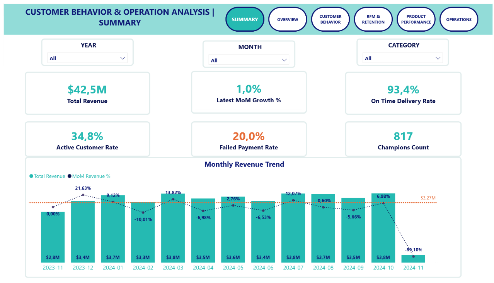
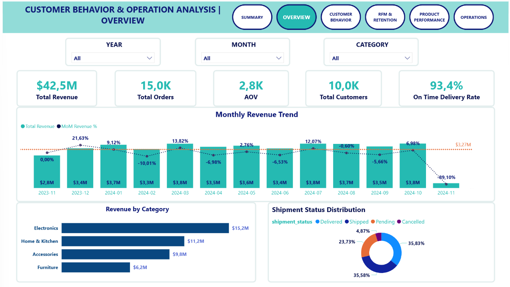
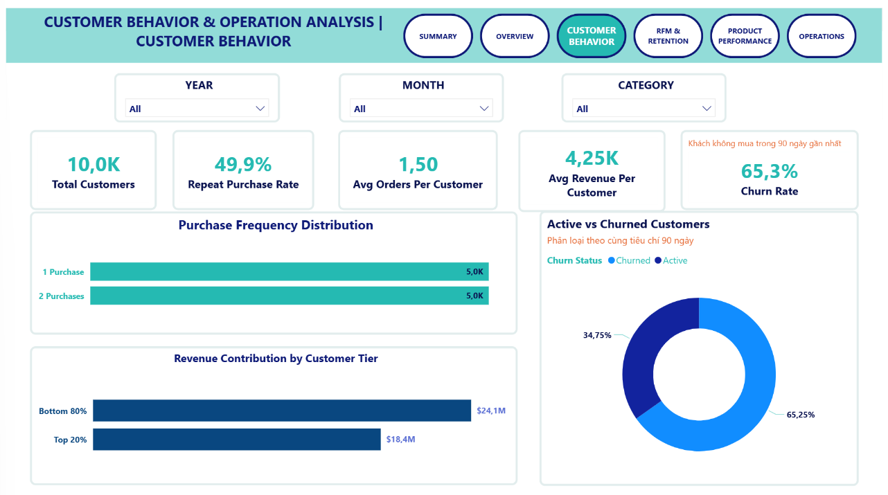
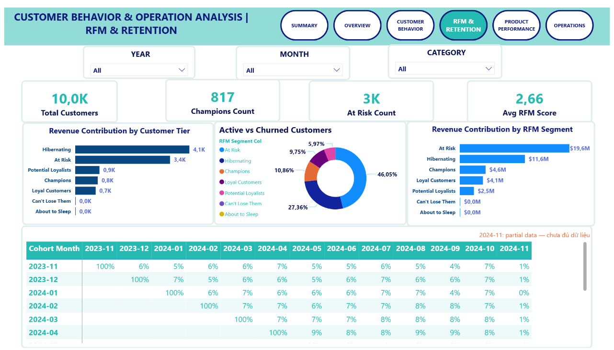
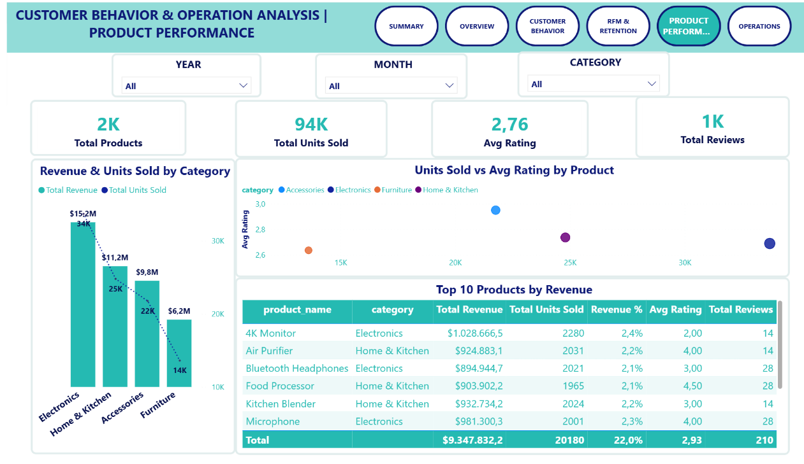
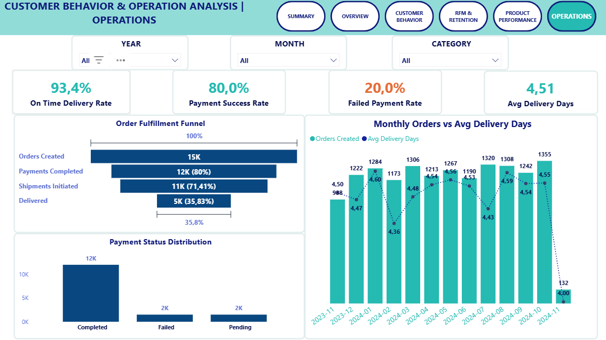

# 🛒 E-Commerce Sales & Customer Analytics
### Customer Behavior & Operational Efficiency | 2023–2024

---

## 1. Project Overview

Một nền tảng thương mại điện tử ghi nhận **10.000 khách hàng**, **15.000 đơn hàng** và **tổng doanh thu ~$42.5M** trong 13 tháng (11/2023 – 11/2024). Tuy nhiên, phía sau con số doanh thu ổn định lại là một vấn đề nghiêm trọng: **hơn 65% khách hàng không quay lại sau 90 ngày**, và phần lớn doanh thu ($31.2M) đang đến từ các nhóm khách hàng đang dần rời đi thay vì nhóm trung thành bền vững.

Project áp dụng **RFM Segmentation, Cohort Retention Analysis và Operational Funnel** để trả lời: *Tại sao khách hàng không quay lại? hững nhóm khách hàng nào mang lại giá trị cao nhất? Và đâu là những nút thắt về vận hành gây ra nguy cơ mất doanh thu tiềm năng?*

Kết quả: xác định **$8M+ doanh thu có thể phục hồi** từ nhóm khách hàng có nguy cơ rời đi, phát hiện **20% đơn hàng thất bại ngay ở bước thanh toán**, và đề xuất các kế hoạch hành động cụ thể phù hợp với từng phân khúc khách hàng.

---

## 2. Objectives

1. **Xác định xu hướng doanh thu** theo thời gian và theo danh mục sản phẩm để xác định xem tăng trưởng có đến từ đúng các danh mục hay không?
2. **Định nghĩa và đo lường tỷ lệ khách hàng rời bỏ** bằng ngưỡng 90 ngày, phân loại tất cả khách hàng thành nhóm Khách hàng đang hoạt động hoặc Khách hàng đã rời bỏ.
3. **Thực hiện phân khúc RFM** để xác định khách hàng nào tạo ra giá trị cao nhất và khách hàng nào có nguy cơ rời bỏ, cho phép phân bổ nguồn lực tốt hơn giữa các nhóm khách hàng.
4. **Tiến hành phân tích tỷ lệ giữ chân khách hàng theo nhóm dựa trên tháng mua hàng đầu tiên** để đánh giá xem tỷ lệ giữ chân có được cải thiện theo thời gian hay vấn đề là do hệ thống?
5. **Phân tích quy trình vận hành** (Thanh toán → Vận chuyển → Giao hàng) để xác định tỷ lệ doanh thu bị mất ở mỗi giai đoạn?
6. **Đưa ra các khuyến nghị khả thi** được điều chỉnh phù hợp với từng phân khúc khách hàng và các điểm nghẽn vận hành cụ thể để triển khai ngay lập tức.

---

## 3. Project Scope & Tools

| Thành phần | Chi tiết |
|---|---|
| **Data scope** | Tháng 11/2023 – Tháng 11/2024 (~13 tháng) |
| **Dataset** | 8 bảng, 44 cột: `customers`, `orders`, `order_items`, `products`, `payment`, `shipments`, `reviews`, `suppliers` |
| **SQL** | MySQL — EDA, data cleaning, VIEW-based modeling, RFM scoring, Cohort analysis |
| **Visualization** | Power BI Desktop — DAX measures, Power Query, dashboard 6 trang |
| **Phương pháp** | RFM Segmentation (NTILE), Cohort Retention Matrix, Order Fulfillment Funnel |

---

## 4. Repository Structure

```
ecommerce-customer-analytics/
├── queries/
│   ├── 01_eda.sql              # Khám phá & chẩn đoán dữ liệu: null, duplicate, outlier, range
│   ├── 02_cleaning.sql         # Chuẩn hóa & làm sạch: TRIM, CAST, COALESCE
│   └── 03_analysis.sql         # EDA tổng hợp, VIEW: customer_order_summary, vw_rfm_churn, vw_cohort_retention
├── reports/
│   └── E-Commerce_Sales_Customer_Analytics.pdf
├── visuals/
│   └── [screenshots từng trang dashboard]
└── README.md
```

---

## 5. Data Workflow

```
Raw Data
└── Online Shop 2024 — Kaggle (8 bảng, 44 cột)
        │
        ▼
[01_eda.sql]
    Kiểm tra NULL, duplicate email, orphan orders
    Kiểm tra giá trị bất thường (payment âm, rating ngoài 1–5)
    Xác nhận range ngày dữ liệu → xác định churn cutoff
    Summary tổng hợp vấn đề toàn bộ bảng
        │
        ▼
[02_cleaning.sql]
    TRIM khoảng trắng: customers, products
    CAST kiểu dữ liệu: price → DECIMAL, quantity → UNSIGNED
    COALESCE xử lý NULL: phone_number → 'Unknown', supplier_id → 0
    Chuẩn hóa transaction_status: TRIM + UPPER
        │
        ▼
[03_analysis.sql]
    EDA tổng hợp: doanh thu theo tháng, top sản phẩm, phân bố payment, rating theo category
    VIEW customer_order_summary  → base metrics per customer (frequency, monetary, recency, churn)
    VIEW vw_rfm_churn            → RFM score (NTILE 4) + 7 phân khúc
    VIEW vw_cohort_retention     → monthly cohort × retention rate
        │
        ▼
Power BI
    Import 3 VIEWs từ MySQL
    Xây dựng DAX measures: Approval Rate, YoY, Churn %
    Dashboard 6 trang: Summary · Overview · Customer Behavior · RFM & Retention · Product Performance · Operations
        │
        ▼
Insights & Recommendations
```

---

## 6. Data Model & Schema

**Nguồn:** [Online Shop 2024](https://www.kaggle.com/datasets/marthadimgba/online-shop-2024) — Kaggle, License: Apache 2.0

| Bảng | Mô tả | Số dòng (ước tính) |
|---|---|---|
| `customers` | Thông tin khách hàng | ~10.000 |
| `orders` | Đơn hàng | ~15.000 |
| `order_items` | Chi tiết sản phẩm trong từng đơn | ~94.000 units |
| `products` | Danh mục và thông tin sản phẩm | ~2.000 |
| `payment` | Giao dịch thanh toán theo đơn | ~15.000 |
| `shipments` | Trạng thái và thời gian giao hàng | ~15.000 |
| `reviews` | Đánh giá sản phẩm từ khách hàng | ~1.000 |

**Key joins:**
- `orders → payment` (order_id)
- `orders → order_items → products` (order_id, product_id)
- `customers → orders` (customer_id)

---

## 7. ERD

```
customers ──< orders ──< order_items >── products >── suppliers
                 │
                 ├──< payment
                 └──< shipments

customers ──< reviews >── products
```

---

## 8. Analysis & Metrics

### Churn Definition
- **Churned:** Không có đơn hàng trong **90 ngày** tính từ ngày đặt hàng gần nhất
- **Active:** Có đơn hàng trong vòng 90 ngày gần nhất (so với `MAX(order_date)` toàn hệ thống)
- *Lý do chọn 90 ngày: ngưỡng phổ biến với e-commerce đa danh mục; chi tiết xem phần Assumptions*

### RFM Scoring
- Dùng `NTILE(4)` để chia điểm 1–4 cho từng chiều **Recency / Frequency / Monetary**
- Recency: điểm cao = mua gần nhất → `ORDER BY recency_days DESC`
- Frequency & Monetary: điểm cao = nhiều/cao hơn → `ORDER BY ASC`
- **7 phân khúc:** Champions · Loyal Customers · Potential Loyalists · New Customers · At Risk · Can't Lose Them · Hibernating

### Cohort Retention
- Cohort xác định theo tháng đặt hàng đầu tiên: `DATE_FORMAT(MIN(order_date), '%Y-%m')`
- `months_since_first` tính bằng `TIMESTAMPDIFF(MONTH, first_order_month, order_month)`
- Retention rate = `active_customers / cohort_size × 100`

---

## 9. Key Insights

### 1. Churn 65% — phần lớn khách hàng chỉ mua một hoặc hai lần
Chỉ **34.8%** (3.480 khách) còn Active tại thời điểm phân tích. Phân phối số lần mua gần như chia đôi: ~5.000 người mua đúng 1 lần, ~5.000 người mua 2 lần — không có nhóm mua 3 lần trở lên đáng kể. Retention gần như không tồn tại sau lần mua thứ 2, cho thấy thiếu cơ chế giữ chân hệ thống chứ không phải vấn đề sản phẩm.

### 2. $31M doanh thu đang "sống nhờ" nhóm khách hàng sắp rời đi
**At Risk ($19.6M)** và **Hibernating ($11.6M)** chiếm ~73% tổng doanh thu, trong khi Champions — nhóm lý tưởng — chỉ đóng góp $4.6M (~11%). Doanh nghiệp đang phụ thuộc vào khách hàng đang dần biến mất thay vì nhóm gắn bó lâu dài. Đây là rủi ro tăng trưởng trực tiếp, không phải cảnh báo mang tính dự báo.

### 3. Cohort Retention sụp đổ ngay tháng đầu tiên và không phục hồi
Mọi cohort đều rơi từ 100% (Month 0) xuống **5–9%** từ tháng thứ 1, sau đó duy trì ổn định ở mức đó. Không cohort nào cải thiện theo thời gian — kể cả các cohort mới hơn. Điều này loại trừ nguyên nhân mùa vụ và chỉ ra vấn đề cơ cấu: không có onboarding flow, email remarketing, hay loyalty mechanism nào đủ hiệu quả để giữ khách sau lần mua đầu.

### 4. Electronics dẫn đầu doanh thu nhưng có rating thấp nhất — tín hiệu churn ẩn
Electronics đạt **$15.2M (36% doanh thu)** và 34K units bán ra — cao nhất tất cả danh mục. Tuy nhiên, rating trung bình của danh mục này thấp hơn đáng kể so với Home & Kitchen (Food Processor: 4.5 sao). Doanh thu cao + satisfaction thấp = nhóm khách hàng Electronics có nguy cơ không quay lại cao nhất.

### 5. Phễu thanh toán làm mất 20% doanh thu tiềm năng trước khi đơn được xử lý
Trong 15.000 đơn tạo, chỉ **12.000 (~80%) hoàn thành thanh toán** — tức 3.000 đơn thất bại trước khi vào hệ thống xử lý. Sau thanh toán, 71.4% chuyển sang giao hàng và 35.8% giao thành công đến tay khách. Mỗi điểm rơi trong phễu này là doanh thu không được ghi nhận, chưa kể chi phí acquisition đã bỏ ra để có đơn đó.

### 6. Top 20% khách hàng tạo ra 43% doanh thu — cao hơn dự kiến so với Pareto
Nhóm top 20% ($18.4M) so với bottom 80% ($24.1M): tỷ lệ 43% tiệm cận nguyên tắc Pareto. Với nguồn lực chăm sóc khách hàng có hạn, tập trung vào nhóm này sẽ cho ROI cao hơn đáng kể so với chiến lược giữ chân đồng đều toàn bộ tệp.

---

## 10. Recommendations

### 🎯 Retention & Win-Back

| Nhóm | Insight dẫn đến đề xuất | Hành động cụ thể | Ưu tiên |
|---|---|---|---|
| **At Risk** (3.4K khách, $19.6M) | Recency cao nhưng lịch sử chi tiêu tốt — còn khả năng phục hồi nếu tiếp cận đúng thời điểm | Triển khai win-back email trong ngày 60–80 sau lần mua cuối, ưu đãi cá nhân hóa theo danh mục đã mua; ưu tiên sub-group monetary cao để tối đa ROI | 🔴 Cao nhất |
| **Cohort Month 0→1 drop-off** | 90%+ khách rời đi sau lần mua đầu vì không có cơ chế giữ chân | Thiết kế onboarding flow: email cảm ơn + gợi ý sản phẩm liên quan + ưu đãi mua lần 2 trong 30 ngày đầu | 🔴 Cao |
| **Hibernating** (4.1K khách, $11.6M) | Đã lâu không mua nhưng từng có giá trị — chi phí reactivation thấp hơn acquisition | Reactivation campaign: discount + social proof (trending products); giới hạn 2 lần tiếp cận, dừng nếu không phản hồi để tối ưu chi phí | 🟠 Cao |
| **Champions** (817 khách, $4.6M) | Nhóm nhỏ nhưng LTV cao — chi phí giữ chân thấp hơn nhiều so với acquisition tương đương | Xây dựng loyalty tier: early access, free shipping, birthday offer | 🟡 Trung bình |

### ⚙️ Operational Improvement

| Vấn đề | Nguyên nhân nghi ngờ | Hành động | Team |
|---|---|---|---|
| **20% failed payment** | Phương thức thanh toán không phù hợp hoặc lỗi UX tại checkout | Audit payment method có tỷ lệ fail cao nhất; thêm retry flow và alternative options (ví điện tử, BNPL) | Product / Payment |
| **Electronics rating thấp** | Mô tả sản phẩm không khớp thực tế hoặc vấn đề đóng gói/vận chuyển | Review sản phẩm có rating ≤ 2.5: kiểm tra mô tả, hình ảnh, quy trình đóng gói | Category Management |
| **Delivered rate 35.8%** | Có thể là data cutoff issue hoặc bottleneck thực tại khâu last-mile | Đối chiếu với warehouse logs; thiết lập SLA Shipped → Delivered theo khu vực | Logistics / Ops |

---

## 11. Assumptions & Limitations

**Assumptions:**
- **Ngưỡng churn 90 ngày** là chuẩn phổ biến trong e-commerce đa danh mục. Tuy nhiên Electronics (chu kỳ mua dài) và FMCG (chu kỳ mua ngắn) có thể cần ngưỡng khác nhau — đây là điểm cần validate với business nếu phân tích sâu theo danh mục.
- **Tháng 11/2024 là partial data** (chưa đủ 30 ngày tại thời điểm cắt) — cohort tháng này không dùng để kết luận xu hướng.
- **RFM dùng NTILE(4)**: điểm phân vị theo phân phối thực tế của dataset, không phải ngưỡng tuyệt đối cố định — kết quả phân khúc có thể thay đổi nếu dataset được mở rộng.

**Limitations:**
- **Không có dữ liệu acquisition channel**: không thể xác định kênh nào (organic, paid, referral) mang lại khách hàng có LTV cao hơn — đây là missing piece quan trọng để đánh giá ROI marketing.
- **Review count quá thấp**: ~1.000 reviews cho ~94.000 units sold (~1%) — rating trung bình theo danh mục có thể không đại diện cho mức độ hài lòng thực sự.
- **Không có customer support data**: không thể liên kết trải nghiệm dịch vụ (ticket, complaint) với churn — bỏ sót một chiều phân tích có thể quan trọng.
- **Không có industry benchmark**: các tỷ lệ churn, retention, RFM được đánh giá tương đối trong nội bộ dataset, không có cơ sở so sánh với thị trường.

---

## 12. Future Enhancements

- [ ] **Customer Lifetime Value (CLV) prediction** — xây dựng model dự báo bằng Python (BG/NBD hoặc Pareto/NBD)
- [ ] **Product affinity / basket analysis** — sản phẩm nào thường được mua cùng nhau → gợi ý cross-sell
- [ ] **Churn prediction model** — phân tích theo đặc điểm: category, payment method, region
- [ ] **A/B test framework** — thiết kế chuẩn để đo hiệu quả win-back và onboarding campaign

---

## 13. Deliverables

- ✅ `queries/01_eda.sql` — Khám phá & chẩn đoán dữ liệu: null, duplicate, outlier, range check
- ✅ `queries/02_cleaning.sql` — Chuẩn hóa & làm sạch: TRIM, CAST, COALESCE
- ✅ `queries/03_analysis.sql` — EDA tổng hợp, VIEW RFM, Cohort Retention
- 📎 Dataset gốc: [Online Shop 2024](https://www.kaggle.com/datasets/marthadimgba/online-shop-2024) — Kaggle, License: Apache 2.0 | 8 bảng, 44 cột
- ✅ Power BI Dashboard (6 trang): Summary · Overview · Customer Behavior · RFM & Retention · Product Performance · Operations
- ✅ `reports/E-Commerce_Sales_Customer_Analytics.pdf` — Export dashboard
- ✅ README với full insights & recommendations

---

## 14. Dashboard Preview

### Trang 1 — Summary


### Trang 2 — Overview


### Trang 3 — Customer Behavior


### Trang 4 — RFM & Retention


### Trang 5 — Product Performance


### Trang 6 — Operations


---

## 15. Author

**Phan Ngoc Kim Thoa**
- 📧 thoaphan2921@gmail.com
- 💼 [LinkedIn](https://www.linkedin.com/in/thoangoc2906)
- 🐙 [GitHub](https://github.com/thoangoc2921)

---

*Case study phân tích dữ liệu thực chiến — SQL + Power BI cho bài toán Customer Analytics trong thương mại điện tử.*
